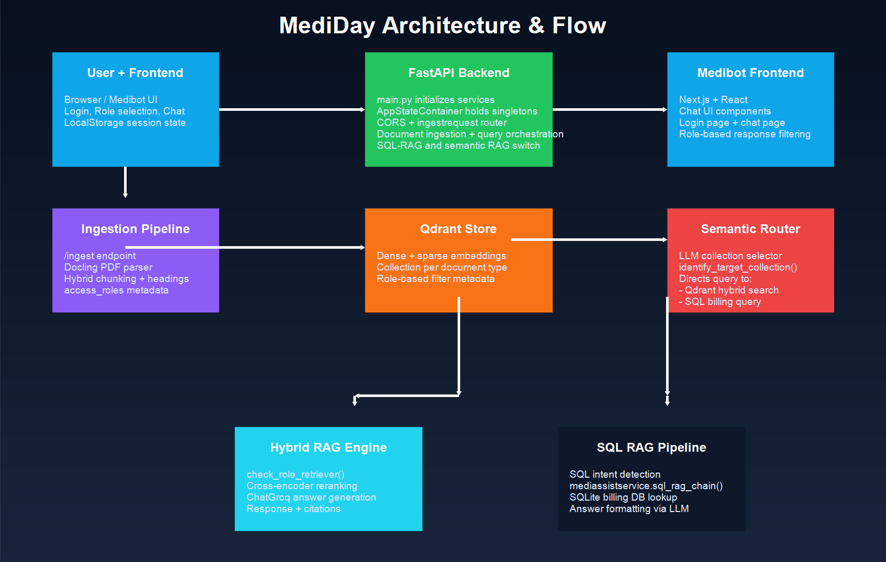
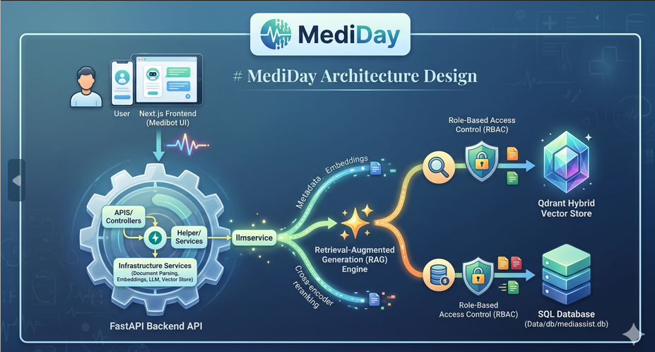
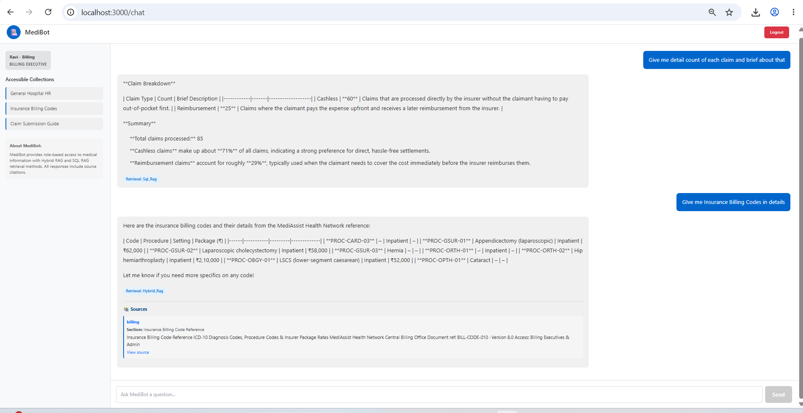
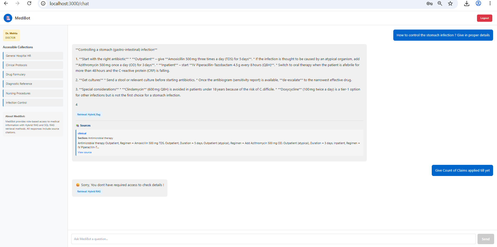

# MediDay

MediDay is a hybrid AI-powered medical assistant platform that combines a FastAPI backend with a Next.js frontend. It is designed to support a Retrieval-Augmented Generation (RAG) workflow for medical document ingestion, semantic search, role-based access control, and SQL-backed analytics.

## Table of Contents

- [Project Overview](#project-overview)
- [Architecture](#architecture)
- [Backend](#backend)
  - [Core Services](#core-services)
  - [Request Flow](#request-flow)
  - [Data Handling](#data-handling)
- [Frontend](#frontend)
- [Data Sources](#data-sources)
- [Security and Access Control](#security-and-access-control)
- [Installation](#installation)
- [Usage](#usage)
- [Environment Variables](#environment-variables)
- [Directory Structure](#directory-structure)
- [Unit Testing](#unit-testing)
- [Future Enhancements](#future-enhancements)

## Project Overview

MediDay builds an AI medical assistant that can:

- Ingest PDF documents and medical content
- Chunk and index documents into a Qdrant hybrid vector store
- Serve semantic search results to a RAG engine
- Route user queries to the correct collection with an LLM
- Enforce role-based access control at the document level
- Support SQL-based analytics for billing and structured medical data
- Offer a Next.js chat interface for end users

## Architecture

The application is separated into two main layers:

1. Backend API (`main.py`, `APIS/`, `INFRASTRUCTURES/`, `domainentities/`, `helper/`)
2. Frontend chat UI (`Medibot/`)

High-level architecture:

- `main.py` starts a FastAPI app and initializes core services during app lifespan
- `APIS/ingestrequestController.py` exposes ingest and query endpoints
- `INFRASTRUCTURES/` contains document parsing, embeddings, LLM orchestration, and vector store management
- `domainentities/` defines interfaces and data models
- `helper/` provides dependency injection-style state management and chat service orchestration
- `Medibot/` contains the Next.js chat interface and RBAC client logic

### Architecture Diagram



### Architecture Design Visual



### Architecture Diagram (Text)

```
User -> Medibot UI -> FastAPI /api/v1/ingestrequest/query
                   -> medichatservice -> vector store retriever -> Qdrant collection
                   -> llmservice -> ChatGroq / cross-encoder reranker -> response

User -> Medibot UI -> FastAPI /api/v1/ingestrequest/ingest
                   -> QdrantVectorStoreService -> DocumentParser -> Qdrant collection

User -> Medibot UI -> FastAPI /api/v1/ingestrequest/query
                   -> mediassistservice -> SQLDatabase (Data/db/mediassist.db)
```

## Backend

### Core Services

- `main.py`
  - Initializes the FastAPI app
  - Sets up `DoclingParserSevice`, `MediEmbeddingService`, `QdrantVectorStoreService`, `llmservice`, and `mediassistservice`
  - Configures CORS and router registration

- `APIS/ingestrequestController.py`
  - `POST /api/v1/ingestrequest/ingest` ingests a source URL into a Qdrant collection
  - `POST /api/v1/ingestrequest/query` handles both SQL-RAG and semantic RAG queries

- `INFRASTRUCTURES/document_parser.py`
  - Uses Docling to convert PDF documents
  - Chunks content with `HybridChunker`
  - Produces `langchain_core.Document` items with metadata including `access_roles`

- `INFRASTRUCTURES/embedding_service.py`
  - Creates dense HuggingFace embeddings
  - Creates sparse BM25-style embeddings with FastEmbed
  - Supports hybrid retrieval in Qdrant

- `INFRASTRUCTURES/vector_store.py`
  - Creates or validates Qdrant collections
  - Configures hybrid dense+sparse retrieval mode
  - Adds documents into Qdrant
  - Routes queries to the correct collection using a structured LLM prompt

- `INFRASTRUCTURES/llmservice.py`
  - Wraps `ChatGroq` as the conversational LLM
  - Defines a hybrid RAG chain using `create_retrieval_chain`
  - Provides reranking via `ContextualCompressionRetriever`
  - Builds citations and answer payloads

- `helper/chatservice.py`
  - Orchestrates role-aware retrieval
  - Applies Qdrant filters by user role
  - Executes reranking and hybrid response generation

- `domainentities/mediassistentities.py`
  - Handles SQL-RAG for structured database queries
  - Validates access for billing roles
  - Converts natural language to SQLite and formats answers

### Request Flow

#### Document ingestion

1. Client sends `POST /api/v1/ingestrequest/ingest`
2. `QdrantVectorStoreService.initialize_vectorstore()` checks or creates a Qdrant collection
3. `DoclingParserSevice.parse_and_chunk()` converts and chunks PDF content
4. The resulting documents are indexed into Qdrant with metadata and allowed roles

#### Semantic query processing

1. Client sends `POST /api/v1/ingestrequest/query`
2. The controller checks whether the query matches SQL keywords
3. If not SQL, `medichatservice.medibot_chat()` executes
4. A target collection is identified via LLM routing
5. A Qdrant retriever fetches relevant documents filtered by role
6. Cross-encoder reranking is applied
7. Hybrid RAG generates a response with citations

#### SQL-enabled query processing

1. Client sends `POST /api/v1/ingestrequest/query`
2. The controller detects SQL-style questions
3. `mediassistservice.validate_access()` checks user role
4. `mediassistservice.sql_rag_chain()` generates SQL from the question
5. The SQL is executed against `Data/db/mediassist.db`
6. The result is converted into a natural language answer

### Data Handling

- Document chunks are stored as vectors in Qdrant, with metadata including:
  - `Source`
  - `collection`
  - `access_roles`
  - `section_title`
  - `chunk_type`
- Documents are retrieved with hybrid search to support both semantic and sparse keyword matching
- Role filters are applied with Qdrant `FieldCondition` on `metadata.access_roles`

## Frontend

The `Medibot/` folder contains the Next.js chat application.

Key features:

- Login page with demo RBAC users
- Chat interface for sending user queries
- Role-aware session storage
- Sidebar showing collections and user info
- Message bubbles with citations

Important files:

- `Medibot/app/page.tsx` — login page
- `Medibot/app/chat/page.tsx` — chat page
- `Medibot/components/ChatArea.tsx` — message display
- `Medibot/components/ChatInput.tsx` — prompt input
- `Medibot/components/MessageBubble.tsx` — response details
- `Medibot/components/Sidebar.tsx` — navigation and role information
- `Medibot/lib/auth.ts` — authentication helpers
- `Medibot/lib/medibot.ts` — MediBot request/response logic

## Data Sources

- `Data/db/mediassist.db` — SQLite database for billing and analytics queries
- `Data/*` — medical domain documents and content
- `APIS/ingestrequestController.py` can ingest PDFs from a `source_url`

## Security and Access Control

Role-based access control is enforced at multiple levels:

- Document ingestion stores allowed roles in `metadata.access_roles`
- Qdrant retrieval filters against the requesting user's role
- SQL queries are restricted to `billing_executive` and `admin`
- The frontend login uses role-specific demo accounts

## Installation

### Backend

1. Create a Python virtual environment

```bash
python -m venv venv
venv\Scripts\activate
```

2. Install Python dependencies

```bash
pip install -r prerequisitepkgs.txt
```

3. Create a `.env` file with:

```env
EMBEDDING_MODEL=sentence-transformers/all-MiniLM-L6-v2
GROQ_MODEL=gpt-4o-mini
```

4. Run the FastAPI app

```bash
python main.py
```

### Frontend (Medibot)

1. Change into the frontend directory

```bash
cd Medibot
```

2. Install Node dependencies

```bash
npm install
```

3. Start the development server

```bash
npm run dev
```

4. Open [http://localhost:3000](http://localhost:3000)

## Usage

- Call `POST /api/v1/ingestrequest/ingest` to ingest a document
- Call `POST /api/v1/ingestrequest/query` with a JSON payload containing `query` and `user`
- Use the frontend login for role-based scenarios

Example query payload:

```json
{
  "query": "Show me patient billing summary",
  "user": {
    "id": "1",
    "username": "billing.ravi",
    "role": "billing_executive"
  }
}
```

## Environment Variables

- `EMBEDDING_MODEL` — embedding model name for HuggingFace embeddings
- `GROQ_MODEL` — chat model name used by `ChatGroq`
- `.env` is loaded in `main.py`, `INFRASTRUCTURES/embedding_service.py`, and `INFRASTRUCTURES/llmservice.py`

## Directory Structure

```
MediDay/
├── APIS/
│   └── ingestrequestController.py
├── Data/
│   ├── billing/
│   ├── clinical/
│   ├── db/
│   ├── equipment/
│   ├── general/
│   └── nursing/
├── INFRASTRUCTURES/
│   ├── document_parser.py
│   ├── embedding_service.py
│   ├── llmservice.py
│   └── vector_store.py
├── domainentities/
│   ├── entities.py
│   ├── interfaces.py
│   └── mediassistentities.py
├── helper/
│   ├── appstatecontainer.py
│   └── chatservice.py
├── Medibot/
│   └── [Next.js chat frontend]
├── main.py
├── pyproject.toml
├── prerequisitepkgs.txt
└── README.md
```

## Unit Testing

Unit tests and integration tests validate the core services and request flows.

### Test Coverage

- Backend API endpoint tests
- Service layer tests for ingestion, retrieval, and RAG
- Frontend component tests
- Role-based access control validation

### Running Tests

```bash
# Backend tests
pytest tests/

# Frontend tests
cd Medibot
npm test
```

### Unit Testing Overview




## Future Enhancements

- Add proper authentication with JWT/OAuth
- Replace demo role login with a real user database
- Use a production Qdrant server instead of local disk path
- Add document-level auditing and HIPAA logging
- Add multilingual support and advanced medical NER
- Improve SQL query safety and auditability
- Add WebSocket or streaming conversational response handling

---

This README is intended to serve as the authoritative project guide for MediDay, including architecture overview, backend and frontend details, data flow, and deployment instructions.
